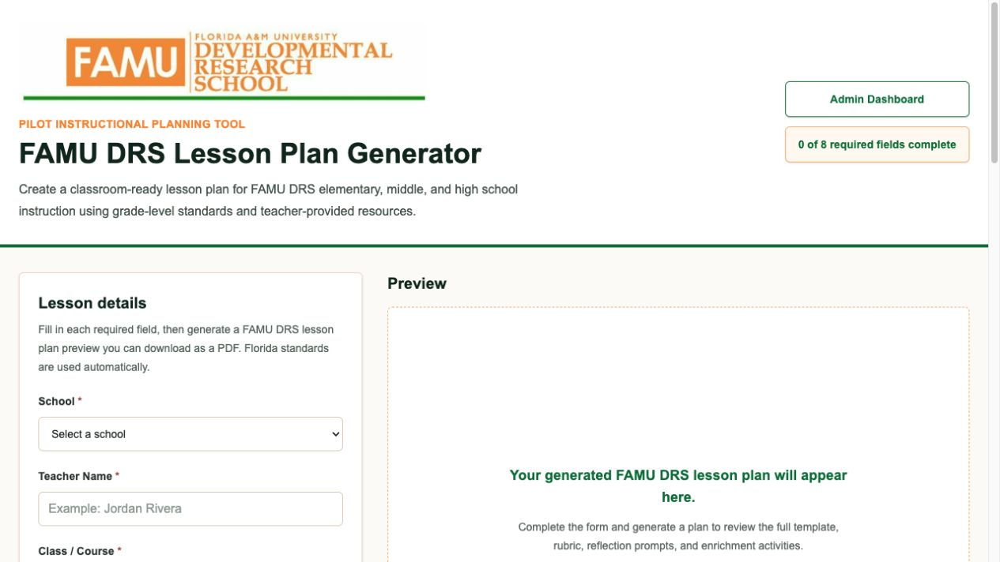
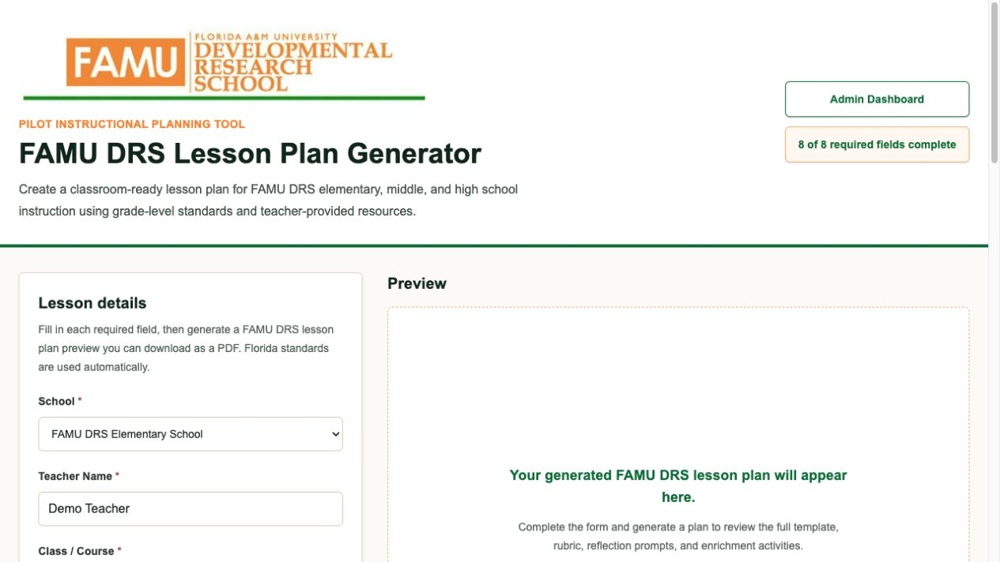
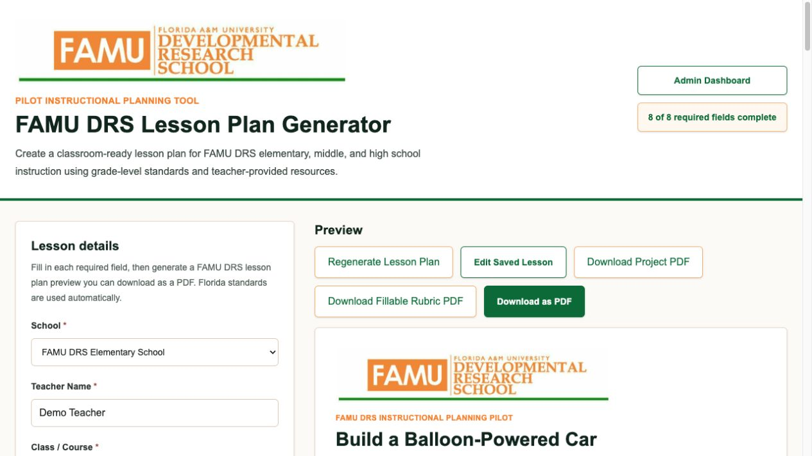
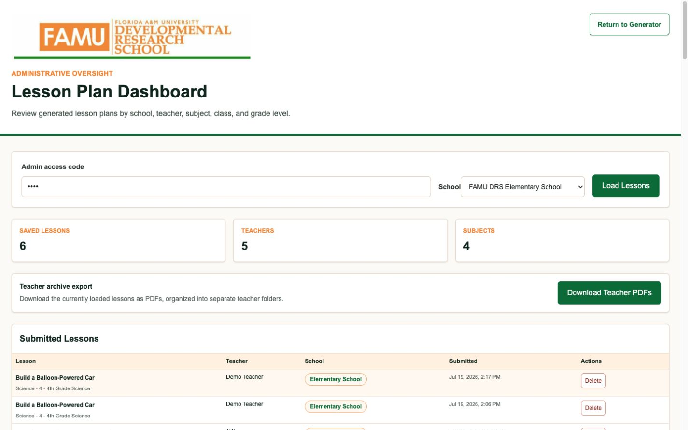

# FAMU DRS AI Lesson Plan Generator

> An AI-powered instructional planning platform designed to help K-12 teachers create standards-aligned lesson plans while giving school administrators a centralized dashboard to support instructional planning.

---

# Application Screenshots

## Homepage

## Lesson Generator

## Generated Lesson Plan

## Admin Dashboard

---

## Overview

The FAMU DRS AI Lesson Plan Generator was originally developed for undergraduate teacher education students at Florida A&M University.

After demonstrating the application to teachers and administrators at Florida A&M Developmental Research School (FAMU DRS), the project evolved into a cloud-based instructional planning platform intended for real-world classroom use.

During **OpenAI Build Week**, the application underwent significant expansion, including new instructional pathways, administrator functionality, cloud deployment improvements, and enhanced user workflows.

The platform is currently being prepared for pilot implementation at **FAMU DRS**.

---

# Why I Built It

Teachers spend countless hours creating lesson plans, aligning instruction with standards, writing objectives, developing assessments, and formatting instructional documents.

This project uses artificial intelligence to reduce repetitive administrative work so educators can spend more time teaching, mentoring students, collaborating with colleagues, and improving instruction.

The goal is **not** to replace teachers.

The goal is to give teachers a high-quality starting point that they can review, revise, and personalize.

---

# Features

### Teacher Dashboard

- AI-generated lesson plans
- Standards-aligned instructional content
- Lesson objectives
- Instructional procedures
- Assessments
- Rubrics
- Differentiation strategies
- Save lesson plans
- Retrieve previously generated lessons

### Administrator Dashboard

- School-wide lesson management
- Teacher account oversight
- Review saved lesson plans
- Organized instructional planning
- Administrative support tools

### Grade-Level Support

- Elementary School
- Middle School
- High School

---

# Built During OpenAI Build Week

Major Build Week additions included:

- Elementary, middle, and high school instructional pathways
- Administrative dashboard
- Teacher and administrator user roles
- Lesson saving functionality
- Supabase integration
- Authentication improvements
- Render deployment improvements
- UI/UX redesign
- Production workflow improvements
- Extensive testing and debugging using Codex

---

# Built With

- OpenAI GPT-5.6
- OpenAI Codex
- ChatGPT
- Next.js
- React
- Supabase
- Render
- GitHub

---

# How AI Helped Build This Project

## ChatGPT

ChatGPT served as my instructional design and prompting partner.

I used ChatGPT to:

- Develop lesson-generation prompts
- Improve instructional design
- Refine teacher workflows
- Structure AI outputs
- Brainstorm features
- Improve administrator workflows

---

## Codex

As a STEM Education professor—not a professional software engineer—Codex became my development mentor.

Throughout this project Codex helped me:

- Learn GitHub workflows
- Understand repositories and commits
- Deploy applications with Render
- Learn Supabase
- Implement authentication
- Debug application issues
- Improve software architecture
- Refactor code
- Design better user experiences

Most importantly, Codex helped transform me from a novice programmer into someone capable of building production-ready educational software.

---

# Technology Stack

| Technology | Purpose |
|------------|---------|
| GPT-5.6 | Lesson generation |
| ChatGPT | Prompt engineering & instructional design |
| Codex | Software development & mentoring |
| Next.js | Frontend framework |
| React | User Interface |
| Supabase | Authentication & Database |
| Render | Cloud deployment |
| GitHub | Version control |

---

# Live Demo

**Application**

https://lesson-plan-generator-8r0j.onrender.com

---

# Repository

https://github.com/bfdtally/lesson-plan-generator

---

# Future Development

Planned enhancements include:

- District dashboards
- Curriculum mapping
- AI assessment generation
- Lesson collaboration
- Expanded standards support
- LMS integration
- Analytics
- Reporting

---

# Acknowledgements

Special thanks to:

- OpenAI
- Codex
- ChatGPT
- Florida A&M University
- Florida A&M Developmental Research School

for helping transform this project from a university classroom assignment into a real-world educational platform.

---

# License

MIT License
